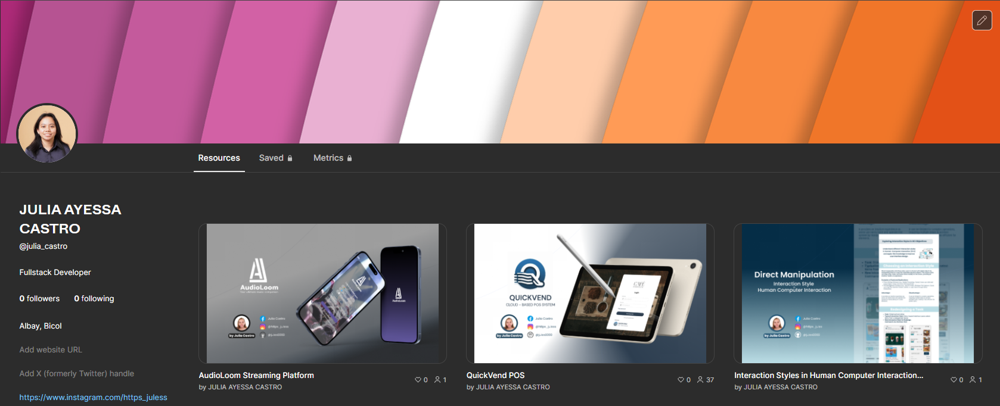

<!-- Modern Sleek Profile Header with Gradient Banner -->

  
  
  

    
  

  
  

    
    
  

  
  

<!-- About Me Section -->

  
<h2> About Me</h2>

  

    
    
    <!-- About Me Content -->
    <ul align="left" style="list-style-type: none;">
      <li>🔭 I'm currently working on <b>Portfolio Projects</b></li>
      <li>🌱 I'm continuously learning <b>Advanced Web Technologies</b></li>
      <li>💬 Ask me about <b>Web Dev, UI/UX, JavaScript, React</b></li>
      <li>⚡ Fun fact: <b>I love solving design challenges</b></li>
    </ul>
  

<!-- Figma Profile -->

  
<h2> Figma Portfolio</h2>

  

    
  

<!-- Connect with me -->

  
<h2> Connect with me</h2>

  

    
    
    
    
    
    
    
  

<!-- Tech Stack -->

  
<h2> Tech Stack</h2>

  <h3>🚀 Programming Languages</h3>
  

    
    
    
    
    
    
    
    
    
  

  <h3>🌐 Frontend Development</h3>
  

    
    
    
    
    
    
    
    
  

  <h3>⚙️ Backend & Frameworks</h3>
  

    
    
    
    
    
  

  <h3>🗄️ Databases</h3>
  

    
    
    
    
    
    
  

  <h3>☁️ Cloud & DevOps</h3>
  

    
    
    
  

  <h3>🎨 Design & Other Tools</h3>
  

    
    
    
    
    
    
    
  

  <h3>🧪 Other Technologies</h3>
  

    
    
    
    
    
    
    
    
  

<!-- GitHub Stats with Modern Cards -->

  
<h2> GitHub Stats</h2>

  
  

    
    
  

  
  

    
  

<!-- GitHub Activity Graph -->

  
<h2> Activity Graph</h2>

  

    
  

<!-- Footer with Modern Wave Design -->

