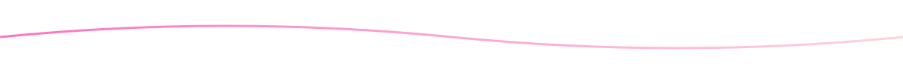

<div align="center">

<!-- Hero Section -->


<br />


<br />
<br />

<p>
  
  
  
</p>

<br />



</div>


</div>

---

## Hi, I'm Julia 👋

I'm a **Fullstack Software Engineer and UI/UX Designer** from the Philippines with **5+ years of experience** building software products, business systems, and web applications.

I work across the entire development lifecycle — from **product thinking and interface design to frontend architecture, backend development, databases, APIs, and deployment**.

I enjoy turning complex requirements into software that is **functional, maintainable, and genuinely pleasant to use**.

Currently, I'm working with **White Elephants Technologies**, contributing to software projects while continuing to build and explore new technologies.

---

## About Me

```javascript
const julia = {
  location: "Philippines",
  role: "Fullstack Software Engineer",
  experience: "5+ years",

  currently: {
    company: "White Elephants Technologies",
    focus: [
      "Fullstack Development",
      "Software Engineering",
      "UI/UX",
      "AI-assisted Development"
    ]
  },

  languages: [
    "JavaScript",
    "TypeScript",
    "Python",
    "C#",
    "C++",
    "Java",
    "PHP"
  ],

  frontend: [
    "React",
    "Next.js",
    "React Native",
    "Angular",
    "Tailwind CSS"
  ],

  backend: [
    "Node.js",
    "ASP.NET",
    ".NET MAUI",
    "Express",
    "Django",
    "PHP"
  ],

  databases: [
    "PostgreSQL",
    "MySQL",
    "MongoDB",
    "SQL"
  ],

  tools: [
    "Git",
    "Docker",
    "Supabase",
    "Figma",
    "Cursor",
    "Ollama"
  ],

  interests: [
    "AI",
    "SaaS",
    "System Design",
    "Product Engineering",
    "UI/UX"
  ]
};
```

---

## What I Do

### Fullstack Engineering

I build applications from the ground up, working across frontend, backend, databases, APIs, authentication, and deployment.

### Product Development

I enjoy taking an idea from **concept → architecture → design → implementation → deployment**, with an emphasis on solving the actual problem rather than just writing code.

### UI/UX Design

My development process is strongly influenced by design. I use **Figma and UX principles** to create interfaces that are intuitive before turning them into production-ready software.

### AI & Emerging Technologies

I'm actively exploring **AI-assisted development, local LLMs, AI integrations, and intelligent software systems**, with a focus on practical applications rather than AI for the sake of AI.

---

## Experience

### Software Engineer

**White Elephants Technologies** • Present
Remote

* Develop and maintain fullstack software applications
* Work across frontend, backend, database, and API layers
* Translate product requirements into functional software
* Collaborate on application architecture, UI/UX, and implementation
* Use modern development tools and AI-assisted workflows to improve development speed and quality

### Freelance Fullstack Software Engineer

**Self-Employed** • June 2021 – Present
Philippines • Remote

* Delivered fullstack web, desktop, and business applications for clients across different industries
* Managed projects end-to-end, from requirements gathering and UI/UX design to development and deployment
* Designed database architectures and implemented REST APIs, authentication, and application logic
* Built applications using technologies including React, Node.js, PHP, ASP.NET, .NET MAUI, Java, Python, and SQL
* Worked directly with clients to translate business requirements into practical software solutions
* Maintained long-term client relationships through repeat projects and referrals

---

## Education

### University of Santo Tomas – Legazpi

**Bachelor of Science in Computer Science**
Legazpi City, Albay • 2026

Relevant areas of study:

* Fullstack Software Development
* Database Management
* Systems Analysis & Design
* Artificial Intelligence
* Network Communications
* Software Engineering

### Certifications

* **Google UX Design Professional Certificate**
* **Cisco C++ Programming**
* **Cisco Network Communications**
* **Anthropic Academy – Claude 101**
* **Civil Service Commission Professional Eligibility**

---

## Tech Stack

<div align="center">

### Languages


### Frontend


### Backend


### Databases


### DevOps & Tools


### Design


</div>

---

## Current Focus

<div align="center">

<table>
<tr>
<td width="50%" valign="top">

### ⚙️ Software Engineering

Building reliable, maintainable, and scalable fullstack applications across the frontend, backend, databases, and APIs.

</td>
<td width="50%" valign="top">

### 🚀 Product Engineering

Turning ideas and business requirements into practical software products, from architecture and UX to deployment.

</td>
</tr>

<tr>
<td width="50%" valign="top">

### ✦ Artificial Intelligence

Exploring AI integrations, local LLMs, AI-assisted development, and practical applications of intelligent software.

</td>
<td width="50%" valign="top">

### 🎨 UI/UX

Designing thoughtful interfaces and experiences before engineering them, with a focus on usability, consistency, and clarity.

</td>
</tr>
</table>

</div>

### What I'm Working On

- Building production-ready **fullstack applications**
- Exploring **AI-powered software and local LLMs**
- Improving **system architecture and backend engineering**
- Designing **modern interfaces and design systems**
- Experimenting with **SaaS and product development**
- Improving development workflows through **AI-assisted tooling**

---
## Engineering Philosophy

> **Good software solves the problem. Great software makes the solution feel obvious.**

I believe engineering and design shouldn't be separate disciplines.

The best products happen when **architecture, usability, performance, and visual design are considered together**.

My goal isn't simply to make software that works.

It's to build software that **works well, looks intentional, and can actually be maintained.**

---

## Let's Connect

<div align="center">

[](https://linkedin.com/in/julia-castro-936550284)
[](https://www.figma.com/@julia_castro)
[](mailto:juliacastroofficial@gmail.com)
[](https://github.com/jules0000)

<br />

### Building software where engineering meets design.

<br />


</div>
